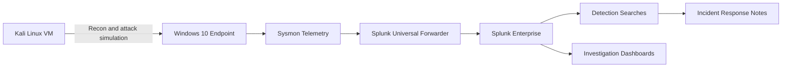

# Endpoint Detection and Attack Simulation Lab

## Overview

This project is an endpoint security lab that demonstrates how attacker behavior on a Windows system can be detected with Sysmon telemetry and Splunk. It addresses a key detection problem: cloud logs can show infrastructure and identity activity, but many attacker techniques only become visible at the host level through process, command-line, network, and user activity.

The lab models a small attacker-and-victim environment using a Kali Linux VM, a Windows 10 endpoint, Sysmon, Splunk Universal Forwarder, and Splunk Enterprise. It is designed to generate detection-worthy endpoint telemetry from common adversary behaviors such as scanning, credential dumping, persistence, suspicious PowerShell usage, and administrative account creation.

The repository is currently documentation-focused. The README describes the intended lab design and detection workflow, while future iterations should add the actual Sysmon configuration, Splunk queries, screenshots, and sample logs to make the evidence stronger.

## Key Features

- Designed a Windows endpoint detection lab using Sysmon and Splunk.
- Modeled an attacker system with Kali Linux and a target endpoint with Windows 10.
- Planned attack simulations for reconnaissance, credential dumping, privilege escalation, persistence, and suspicious process execution.
- Defined detection areas for LSASS access, administrative account creation, scheduled tasks, PowerShell activity, and network reconnaissance.
- Included a SOC-style investigation workflow for correlating process, user, and network activity.
- Identified future improvements for alerting, additional telemetry, lateral movement scenarios, and environment automation.

## Architecture

The lab uses a Kali Linux VM to generate simulated attacker activity against a Windows 10 endpoint. Sysmon records endpoint telemetry on the Windows system, Splunk Universal Forwarder sends those logs to Splunk Enterprise, and Splunk searches/dashboards are used for detection and investigation.

## Tools & Technologies

### Cloud / Infrastructure

- Local virtual lab environment
- Kali Linux VM
- Windows 10 VM

### Security Tools

- Sysmon
- Splunk Universal Forwarder
- Splunk Enterprise
- Nmap
- Mimikatz-style credential dumping scenario

### Programming / Scripting

- PowerShell
- Windows command-line activity
- Splunk SPL searches

### Monitoring / Logging

- Windows Event Logs
- Sysmon process telemetry
- Sysmon network telemetry
- Splunk indexed endpoint logs

### Automation / CI/CD

- No CI/CD pipeline is included in this lab

## Security Concepts Demonstrated

This project demonstrates endpoint detection engineering, host telemetry analysis, adversary simulation, and basic incident response workflows. It focuses on behaviors commonly mapped to MITRE ATT&CK-style techniques, including discovery, credential access, privilege escalation, persistence, and suspicious command execution.

The lab also demonstrates why endpoint telemetry matters. Activities such as LSASS access, process spawning, scheduled task creation, and PowerShell execution are not visible in basic cloud control-plane logs, but they are critical for detecting compromised hosts.

The Splunk workflow demonstrates how a SOC analyst can investigate suspicious activity by looking at parent-child process relationships, user context, command lines, network connections, and event timelines.

## Implementation Steps

1. Designed a two-VM lab with Kali Linux as the attacker system and Windows 10 as the target endpoint.
2. Planned Sysmon deployment on the Windows endpoint for process, network, and security telemetry.
3. Planned Splunk Universal Forwarder installation to ship endpoint logs to Splunk Enterprise.
4. Defined attack simulations for scanning, suspicious PowerShell usage, credential dumping, local administrator changes, and scheduled task persistence.
5. Outlined detection logic for process access, user creation, persistence, and reconnaissance events.
6. Documented a basic incident response workflow for reviewing alerts and tracing attacker activity.

## Results / Findings

The current repository documents the intended lab architecture, attack scenarios, and detection goals. It clearly maps endpoint attack behaviors to the telemetry needed for detection, but it does not yet include populated detection files, screenshots, or sample event logs.

The main finding from the design is that endpoint-level telemetry fills a major visibility gap left by infrastructure-only logging. Process execution, credential access attempts, persistence mechanisms, and command-line behavior require host logs and SIEM analysis to investigate effectively.

## Screenshots

Suggested screenshots to add:

- `screenshots/sysmon-installation.png`
- `screenshots/windows-event-viewer-sysmon.png`
- `screenshots/splunk-endpoint-ingestion.png`
- `screenshots/nmap-scan-detection.png`
- `screenshots/lsass-access-detection.png`
- `screenshots/scheduled-task-detection.png`
- `screenshots/powershell-activity-dashboard.png`
- `screenshots/architecture.png`

## Challenges & Lessons Learned

- Endpoint detection depends on collecting the right telemetry before an attack occurs.
- Sysmon is powerful, but it requires thoughtful configuration to avoid noisy or incomplete logging.
- Parent-child process relationships provide important context during endpoint investigations.
- Credential dumping and persistence often require process-level visibility rather than only authentication logs.
- This repo would be significantly stronger with real logs, detection queries, and screenshots from the lab.

## Relevance to Security Roles

This project maps well to SOC Analyst, Detection Engineer, Incident Response Analyst, and Endpoint Security Engineer responsibilities. It shows understanding of host-based telemetry, SIEM-based investigation, attack simulation, and detection design.

It is also useful for Security Engineer roles because it demonstrates how endpoint logs can complement cloud and network monitoring.

## Future Improvements

- Populate `detection/splunk-queries.md` with actual SPL detection queries.
- Add a Sysmon configuration file or link to the configuration used.
- Add sanitized sample Sysmon events for each attack scenario.
- Include screenshots from Splunk searches and dashboards.
- Add a short incident report for one simulated attack path.
- Expand scenarios to include lateral movement, remote service creation, and suspicious registry changes.
- Automate lab setup with scripts or infrastructure notes.
